<p align="center">
    <h1>Proyecto de Estructuras Abstractas de Datos y Algoritmos para Ingeniería - IE0217</h1>
    <h3>Investigación, diseño e implementación de un sistema de gestión bancaria.</h3>
    <p>Profesor: Esteban Badilla Alvarado</p>
    <p>Estudiantes: <br>Sergio Castillo Víquez, C31824 <br>
    Rodrigo Sánchez Araya, C37259<br>
    Jonathan Monge Cascante, B94955
    </p>
</p>

## Tabla de contenidos
- [Contextualización del proyecto](#contextualización-del-proyecto)
- [Instrucciones para la ejecución](#instrucciones-para-la-ejecución)
- [Primera Fase del Proyecto - Parte Teórica](#primera-fase-del-proyecto)
- [Definición de términos e ideas](#definición-de-términos-e-ideas)
- [Primera Fase del Proyecto - Parte de Diseño](#primera-fase-del-proyecto-parte-de-diseño)
- [Pruebas de Ejecución del programa](#purebas-de-ejecución-del-programa)
- [Cronograma de actividades](#cronograma-de-actividades)
- [Referencias](#referencias)


## Contextualización del proyecto

El objetivo principal fue diseñar, programar e implementar un **sistema de gestión bancaria** orientado a la operación de agentes de atención al cliente en ventanillas. La solución desarrollada permite simular funcionalidades clave de una entidad financiera, como:

- Consulta y manejo de cuentas en colones y dólares.
- Gestión de préstamos (personales, prendarios e hipotecarios).
- Operaciones como depósitos, retiros, transferencias y abonos a préstamos.
- Generación de tablas de amortización y reportes tabulares en formato de texto.
- Identificación única de clientes y registro histórico de transacciones.

El proyecto se desarrolló en **C++** con enfoque en buenas prácticas de **programación orientada a objetos**, y utilizando **SQLite** para el almacenamiento de datos. Además, se documentó utilizando **Doxygen**, y su organización y control de versiones se gestionó a través de **GitHub**.

También se diseñó un sitio web con la documentación técnica del proyecto, disponible en:  
🔗 [https://proyecto-ie0217-rsj.netlify.app](https://proyecto-ie0217-rsj.netlify.app)


## Instrucciones para la ejecución 

El código funciona mediante el uso de Makefile mediante los siguientes comandos:

**Aegúrese de estar dentro del repositorio dedicado al proyecto**

```bash
# Debe ubicarse en el mismo nivel en donde se encuentra el Makefile
cd ./ie0217-proyecto
```
**Puede ejecutar, dependiendo de su sistema opetarivo:**

**Windows**

```
mingw32-make run
```

**Mac - Linux**
```
make run
```


**El Makefile cuenta con la capacidad de distingir el os con el que se trabaja**


```makefile
ifeq ($(OS), Windows_NT)
    OSFLAG = WINDOWS
    INCLUDE = -IC:\sqlite -IC:\Program-Files\OpenSSL-Win64\include
    LIBDIRS = -LC:\sqlite -LC:\Program-Files\OpenSSL-Win64
    LIBS = -lsqlite3 -lssl -lcrypto
else
    UNAME_S := $(shell uname -s)
    ifeq ($(UNAME_S), Darwin)  # macOS
        OSFLAG = MAC
        INCLUDE = -I/opt/homebrew/opt/sqlite/include -I/opt/homebrew/opt/openssl@3/include
        LIBDIRS = -L/opt/homebrew/opt/sqlite/lib -L/opt/homebrew/opt/openssl@3/lib
        LIBS = -lsqlite3 -lssl -lcrypto
    else
        OSFLAG = LINUX
        INCLUDE = -I/usr/include
        LIBDIRS = -L/usr/lib
        LIBS = -lsqlite3 -lssl -lcrypto
    endif
endif
```

## Primera Fase del Proyecto 

## Parte Teórica

## Definición de términos e ideas
Para tener una idea clara de lo que se quiere realizar es necesario definir los términos utilizados dentro de este proyecto, por lo tanto, se debe investigar y definir cada uno de ellos y determinar qué conllevan y cómo se implementan. Esto con el fin de que, a la hora de implementarlos dentro del código, ya sea como una función o de alguna otra forma, estos sean realistas y se apeguen a un funcionamiento real.

### Atención a clientes
Basándose en un banco, podemos observar las opciones de atención a clientes que este brinda. Por ejemplo, el Scotiabank proporciona un número telefónico al que se puede llamar, también permite un chat en línea, por lo tanto, se puede implementar que esta opción brinde la información de contacto necesaria. 

### Préstamos Personales
Están enfocados en cubrir necesidades a corto plazo y en general enfocados en gastos propios o familiares, por lo general y basándose en el banco Scotiabank las tasas de interés van de 23% a 24% en colones y son de tasa fija. Además, estos préstamos en este banco son realizables únicamente en la opción de colones, estos datos también son muy distintos dependiendo del banco en el que se busque, sin embargo, por indicación el monto del préstamo será ingresado por el usuario, quien también podrá personalizar los valores de monto, número de cuotas y la tasa de interés.

### Préstamos Prendarios
Estos préstamos son principalmente financiamientos para compra de bienes de capital, vehículos principalmente, por lo que se toma como un sistema de financiamiento que permite obtener la aprobación del crédito para vehículo, nuevamente tomando como base el banco Scotiabank este, por ejemplo, da primas desde el 10%, plazos de hasta 96 meses y la opción de colones y dólares, pero nuevamente el monto del préstamo será ingresado por el usuario, también podrá personalizar los valores de monto, número de cuotas y tasa de interés.

### Préstamos Hipotecarios
Los préstamos hipotecarios son préstamos a mediano o largo plazo y, por lo general, se otorgan para la compra, ampliación, reparación o construcción de una vivienda, compra de sitios, oficinas o locales comerciales y son generalmente créditos que permiten a las personas adquirir una vivienda. Estos, basándonos en el banco ya dicho ofrece este crédito en la opción de dólares o colones con tasas de 10 a 10,50% en colones y de 6,95 a 8,50% en dólares. Nuevamente y al igual que los anteriores préstamos dichos, el monto del préstamo será ingresado por el usuario; también podrá personalizar los valores de monto, número de cuotas y tasa de interés.

### Abonos a préstamos propios o de terceros
Los abonos son pagos en una cantidad adicional al pago mínimo requerido por el préstamo con la cual se tiene una obligación, y esa cantidad extra se destina directamente a reducir el monto principal del préstamo. Por lo que esta se ve como una reducción directa al monto total del préstamo que puede ser tanto a el personal como al de un tercero.

### Tasa de interés, plazo en meses y cuota mensual en los préstamos
El interés es un precio que el cliente paga a la entidad por disponer del capital prestado. El Plazo es un periodo de tiempo estipulado en el contrato para devolver el principal más el interés. Las cuotas son la cantidad que se deben pagar cada mes e incluyen el interés y la parte proporcional de la cantidad utilizada del total del préstamo.

### Tipos de interés
**Interés fijo :** 
El interés fijo refiere al tipo de interés que se mantiene constante a lo largo del tiempo del préstamo, es decir, se mantiene invariable respecto a la tasa de interés del mercado.

**Interés variable :** 
Al contrario del interés fijo, este es actualizado respecto a la tasa de interés del mercado bajo plazos establecidos por la entidad financiera. Además, la entidad define previamente un rango dentro del cual varía el tipo de interés.

**Interés mixto :**
Cómo lo indica su nombre, este tipo de interés mezcla los dos tipos de interés anteriores, de modo que durante los primeros años del préstamo el tipo de interés es fijo; sin embargo, durante los años restantes del préstamo, el interés es de tipo variable.

### Abonos al capital en préstamos
Es abonar al total del prestamo y no a los intereses, entonces, como cada mes la cuota llega por un monto de capital y un monto de intereses, en algunos créditos se puede abonar a capital, de modo que se reduzca la deuda y solo quede debiendo los intereses.

### Intereses abonados en préstamos
Los abonos a interés son pagos adicionales que se realizan sobre la deuda, más allá del pago mínimo mensual requerido.

### Fórmulas para el cálculo de los intereses y cuotas mensuales de los prestamos
Para la obtención de estas formulas nos basamos en los cálculos que se utilizan en Simulador de Préstamos Personales y Empresas - Calculadora Billin, 2018 y la pagina oficial del banco BAC Credomatic la cual incluye múltiples documentos con información detallada al respecto. Estas formulas utilizan principalmente los datos de los intereses, el capital o monto total del préstamo pedido y el plazo en meses del préstamo.

### Fórmula para el cálculo de los intereses de los prestamos
$\text{Cuota de Interés Mensual} = \frac{\text{Cuota Restante} \times \text{Interés Mensual}}{12}$

### Fórmula para el cálculo de las cuotas mensuales para los prestamos personales y prendarios
$\text{Cuota Mensual} = \frac{\text{Capital} \times \text{Interés Mensual}}{1 - (1 + \text{Interés Mensual})^{-12}}$

### Fórmula para el cálculo de las cuotas mensuales para los prestamos hipotecarios
$\text{Cuota Mensual} = \frac{P \cdot i}{1 - (1 + i)^{-n}}$


### Certificados de depósito a plazo (CDP)
Es un depósito que se pacta a un periodo de tiempo, el cual es acordado entre el cliente y el banco. La tasa de interés se establece en base al monto del depósito y el plazo. Es una alternativa de inversión que hace crecer moderadamente el dinero de la cuenta. Básicamente es una herramienta de ahorros de bajo riesgo que puede aumentar el monto que gana por interés, y al mismo tiempo mantener su dinero invertido de una manera relativamente segura.

### Depósitos
Son un producto de ahorro a través del cual los clientes depositan una cantidad de dinero en la entidad financiera durante un periodo de tiempo determinado. Puede verse como un aumento en el saldo disponible de la cuenta bancaria. 

### Retiro 
Un retiro bancario consiste en extraer dinero de un banco, por ende, se refiere a una reducción de dinero de la cuenta bancaria de un usuario registrado, siempre y cuando este tenga fondos disponibles. 

### Transferencia 
Es una operación por la que una persona desde una cuenta suya envíe una determinada cantidad de dinero a la cuenta de otra persona que puede ser de su mismo banco o de otro. Este puede verse como un movimiento en la cuenta del usuario.

## Primera Fase del Proyecto: Parte de Diseño 
Concluida la sección teórica, se detalla el diseño que el programa de gestión bancaria necesita para su correcto funcionamiento según las intrucciones asignadas.

### Diagrama de Flujo 

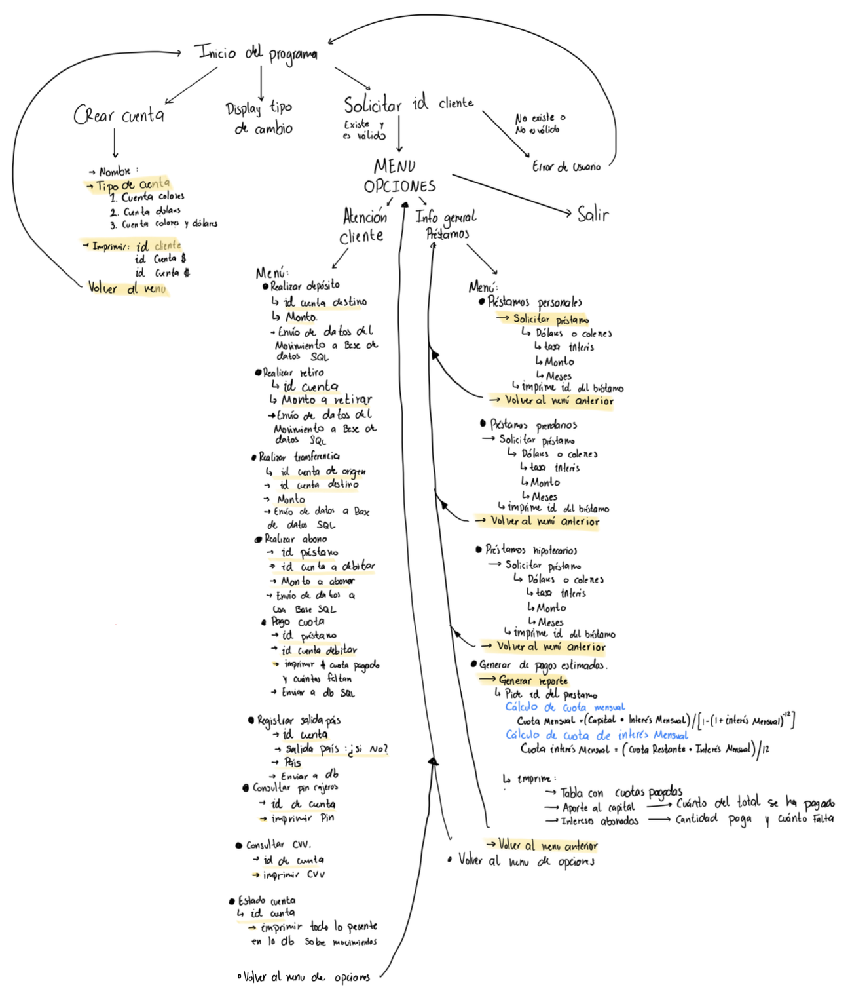


# Esquema de la Base de Datos

## Tabla: `Cuenta_Colones`
| Columna          | Tipo       | Restricciones                                                   |
|------------------|------------|-----------------------------------------------------------------|
| `id`             | INTEGER    | PRIMARY KEY, CHECK(id BETWEEN 0 AND 999999999), NOT NULL       |
| `nombre`         | TEXT       | NOT NULL                                                      |
| `salida_pais`    | BOOLEAN    | NOT NULL, CHECK(salida_pais IN (0, 1))                         |
| `cantidad_dinero`| INTEGER    | NOT NULL, CHECK(cantidad_dinero >= 0), DEFAULT 0               |
| `cvv`            | INTEGER    | NOT NULL, CHECK(cvv BETWEEN 100 AND 999)                      |
| `password`       | TEXT       | NOT NULL                                                      |

---

## Tabla: `Cuenta_Dolares`
| Columna          | Tipo       | Restricciones                                                   |
|------------------|------------|-----------------------------------------------------------------|
| `id`             | INTEGER    | PRIMARY KEY, CHECK(id BETWEEN 0 AND 999999999), NOT NULL       |
| `nombre`         | TEXT       | NOT NULL                                                      |
| `salida_pais`    | BOOLEAN    | NOT NULL, CHECK(salida_pais IN (0, 1))                         |
| `cantidad_dinero`| INTEGER    | NOT NULL, CHECK(cantidad_dinero >= 0), DEFAULT 0               |
| `cvv`            | INTEGER    | NOT NULL, CHECK(cvv BETWEEN 100 AND 999)                      |
| `password`       | TEXT       | NOT NULL                                                      |

---

## Tabla: `Movimientos_Colones`
| Columna          | Tipo       | Restricciones                                                   |
|------------------|------------|-----------------------------------------------------------------|
| `id_cuenta`      | INTEGER    | NOT NULL, FOREIGN KEY REFERENCES `Cuenta_Colones(id)` ON DELETE CASCADE |
| `detalle`        | TEXT       | NOT NULL                                                      |
| `fecha`          | TEXT       | DEFAULT CURRENT_TIMESTAMP, NOT NULL                           |

---

## Tabla: `Movimientos_dolares`
| Columna          | Tipo       | Restricciones                                                   |
|------------------|------------|-----------------------------------------------------------------|
| `id_cuenta`      | INTEGER    | NOT NULL, FOREIGN KEY REFERENCES `Cuenta_Dolares(id)` ON DELETE CASCADE |
| `detalle`        | TEXT       | NOT NULL                                                      |
| `fecha`          | TEXT       | DEFAULT CURRENT_TIMESTAMP, NOT NULL                           |

---

## Tabla: `Prestamos_Colones`
| Columna            | Tipo       | Restricciones                                                   |
|--------------------|------------|-----------------------------------------------------------------|
| `id_prestamo`      | INTEGER    | PRIMARY KEY, CHECK(id_prestamo BETWEEN 0 AND 999999999), NOT NULL |
| `id_cuenta`        | INTEGER    | NOT NULL, FOREIGN KEY REFERENCES `Cuenta_Colones(id)` ON DELETE CASCADE |
| `intereses`        | REAL       | NOT NULL                                                      |
| `meses`            | INTEGER    | NOT NULL                                                      |
| `monto`            | REAL       | NOT NULL                                                      |
| `intereses_abonados`| REAL      | NOT NULL                                                      |
| `saldo_restante`   | REAL       | NOT NULL, CHECK(saldo_restante >= 0)                          |
| `tipo_prestamo`    | TEXT       | NOT NULL                                                      |
| `monto_por_cuota`  | FLOAT      | NOT NULL, CHECK(monto_por_cuota >= 0)                         |
| `cuotas_pagadas`   | INTEGER    | NOT NULL, CHECK(cuotas_pagadas >= 0)                          |

---

## Tabla: `Prestamos_Dolares`
| Columna            | Tipo       | Restricciones                                                   |
|--------------------|------------|-----------------------------------------------------------------|
| `id_prestamo`      | INTEGER    | PRIMARY KEY, CHECK(id_prestamo BETWEEN 0 AND 999999999), NOT NULL |
| `id_cuenta`        | INTEGER    | NOT NULL, FOREIGN KEY REFERENCES `Cuenta_Dolares(id)` ON DELETE CASCADE |
| `intereses`        | REAL       | NOT NULL                                                      |
| `meses`            | INTEGER    | NOT NULL                                                      |
| `monto`            | REAL       | NOT NULL                                                      |
| `intereses_abonados`| REAL      | NOT NULL                                                      |
| `saldo_restante`   | REAL       | NOT NULL, CHECK(saldo_restante >= 0)                          |
| `tipo_prestamo`    | TEXT       | NOT NULL                                                      |
| `monto_por_cuota`  | REAL       | NOT NULL, CHECK(monto_por_cuota >= 0)                         |
| `cuotas_pagadas`   | INTEGER    | NOT NULL, CHECK(cuotas_pagadas >= 0)                          |

## Cronograma de actividades
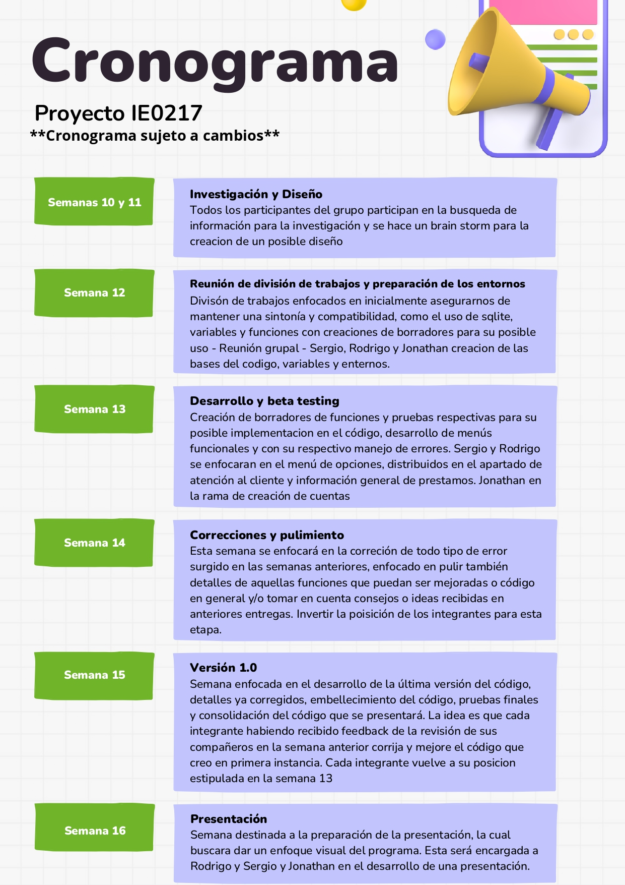


## Purebas de ejecución del programa 

- Ejecucion principal del programa: 

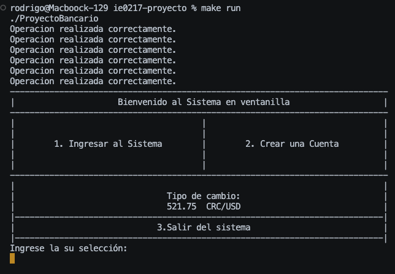

- Manejo de errores en el Main:

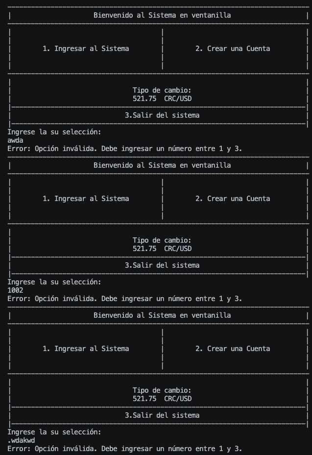


- Creacion de cuenta en colones: 

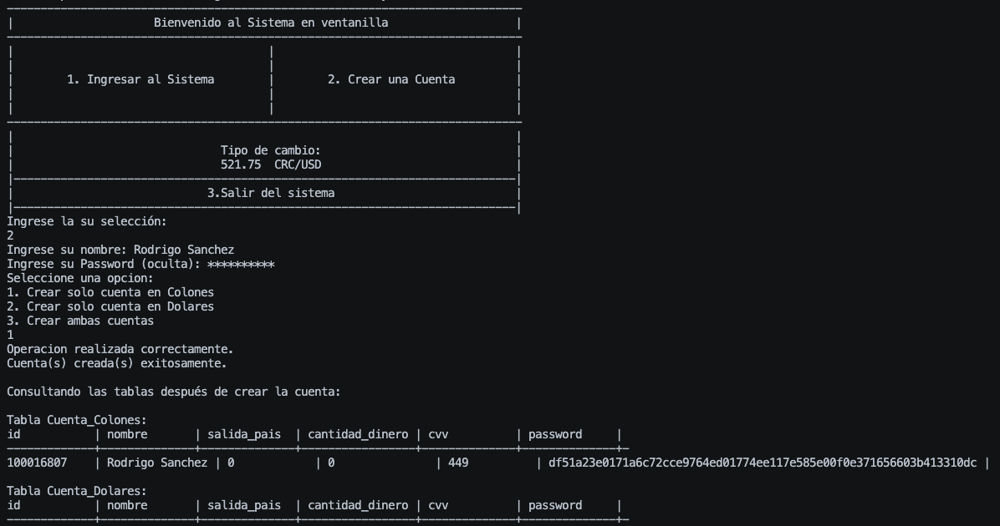


- Creacion de cuenta en colones y dolares: 


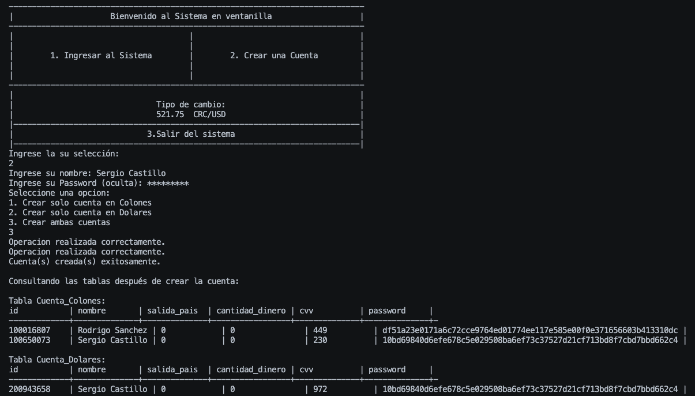

- ID inválido: 

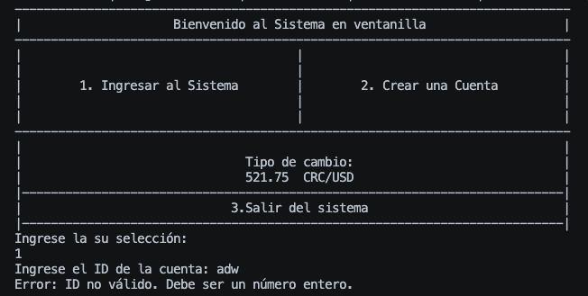

- Manejo Errores en el menú secundario: 

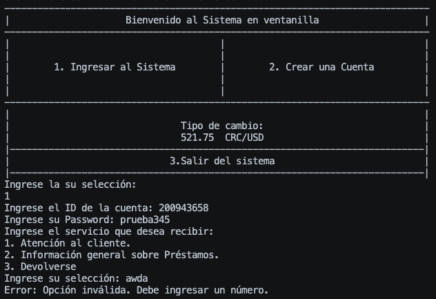

- Deposito y Estado de cuenta: 

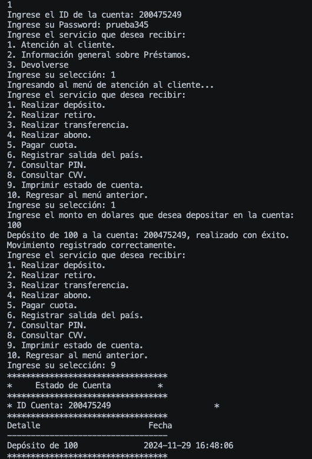


- Retiro con error y sin error: 

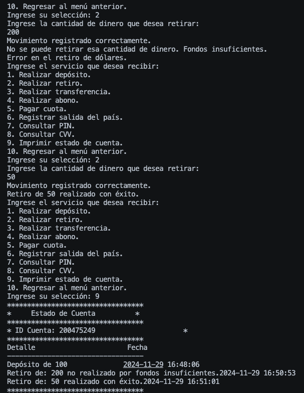

- Salida del país: 

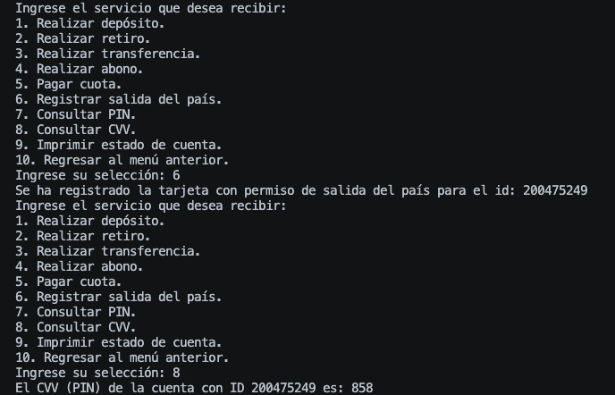

- Error Prestamos: 


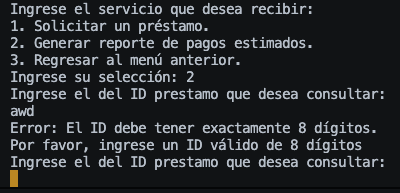

- Prueba Préstamo: 

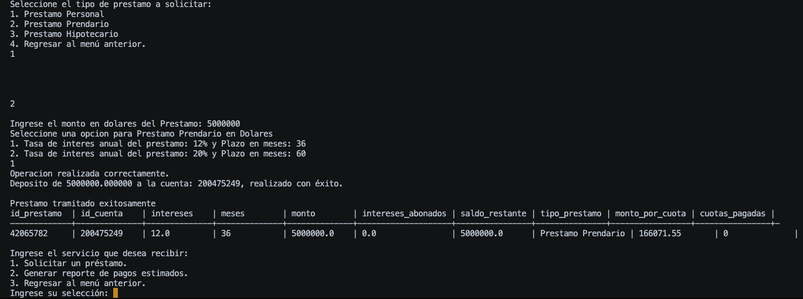

- Prueba Transferencia: 

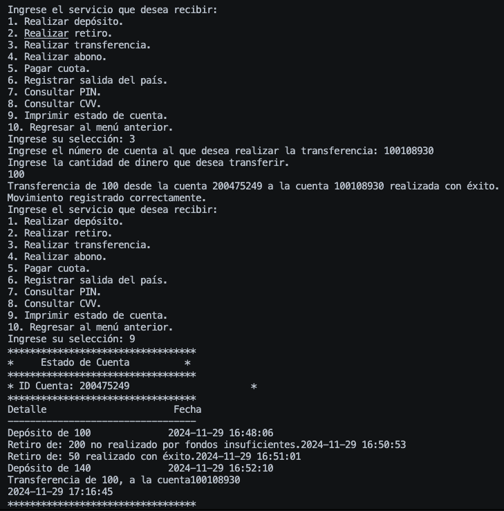

- Abono: 

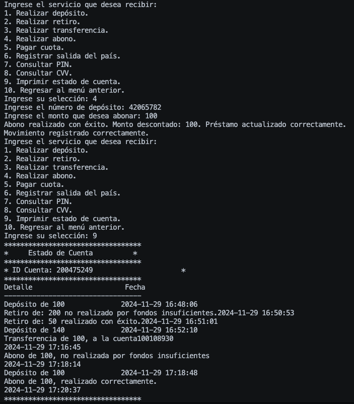


- Pago de cuota: 

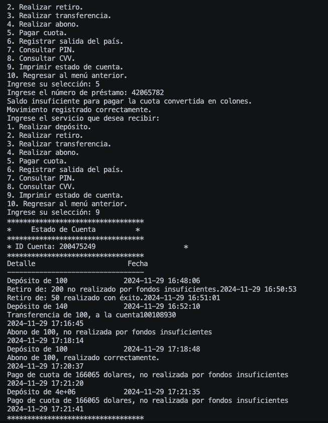


## Bitácora:

| Fecha | Persona | Aporte |
|-----------|-----------|-----------|
| 01/11/24  | Rodrigo Sánchez Araya   |Creación del main. Se agrega función para establecer tipo de cambio CRC/USD   |
| 03/11/24  | Sergio Castillo Víquez    | Creación de base de datos con las cuatro tablas correspondiente a la cuenta en colones, cuenta en dólares, movimientos y préstamos   |
| 05/11/24  | Rodrigo Sánchez Araya    | Firmado de funciones para Atencion Cliente. Se agrega display del menú principal. Agregar archivo de implementación de funciones.   |
| 06/11/24  | Jonathan Monge Cascante    | Creación de prototipos de funciones para manejo de prestamos de diversos tipos.   |
| 06/11/24  | Jonathan Monge Cascante    | Creación de función inicializadora de las tablas en caso de que no existan en la base de datos.  |
| 07/11/24  | Jonathan Monge Cascante    | Creación de prototipo de función para insercion de datos en tablas, en la seccion de creacion de cuenta.  |
| 07/11/24  | Sergio Castillo Víquez   | Creación de funciones para la creación de cuentas, función de hasheo para las contraseñas de las cuentas (OpenSSL), función para abrir la base de datos, función para la consulta de las tablas en la DB, función para la verificación de una cuenta y función de eliminación de cuentas |
| 07/11/24  | Sergio Castillo Víquez   | Implementación de las funciones al main en las opciones de crear una cuenta e ingresar al sistema |
| 08/11/24  | Sergio Castillo Víquez   | Actualizaciones en múltiples funciones para aumentar su documentación y cambios menores |
| 08/11/24  | Rodrigo Sánchez Araya   | Se agrega un menú para las funciones de atención al cliente (Se agrega al main) . Se agrega implementación de las funciones de Depósito, Retiro, Transferencia, Salida del país, Consulta Pin, Consulta CVV.  |
| 08/11/24  | Jonathan Monge Cascante    | Eliminación de archivos y funciones duplicadas o descartadas e inicio del desarrollo de un makefile para compilación. |
| 08/11/24  | Jonathan Monge Cascante    | Implementación de submenú de prestamos personales en colones o dólares y desarrollo de función para inserción de datos de prestamos en tablas.  |
| 26/11/24  | Rodrigo Sánchez Araya    | Ajuste en la estructura de las bases de datos de movimientos (se crea una para movimientos de cuentas en colones y otra para dólares) ajuste en la estructura de las tablas de préstamos (se agrega cant de cuotas por pagar y pagadas), se hace la implementación de las funciones de realizar un abono a un crédito, realizar el pago de una cuota, se agrega la funcion de settear un movimiento y se establece la manera de imprimir los reportes de movimientos. |
| 27/11/24  | Sergio Castillo Víquez    | Creación de UU.cpp archivo que une en uno solo los siguientes codigos AbrirDB.cpp y .hpp, ConsultasDB.cpp y .hpp, TipoCambio.cpp y .hpp y Hash.cpp y .hpp   |
| 27/11/24  | Rodrigo Sanchez Araya   | Se agrega funcionalidad para agregar movimientos la tabla dedicada, se agrega manejo de errores al menú main y al menú de atención al cliente.  |


### Referencias 

1. Billin. (2018). Simulador de préstamos personales y empresas - Calculadora Billin. https://www.billin.net/simulador-prestamos-personales-calculadora/

2. GCFGlobal. Crédito: ¿Cuáles son los tipos de interés? Recuperado el 22 de Octubre, 2024, de https://edu.gcfglobal.org/es/credito/cuales-son-las-tasas-de-interes/1/